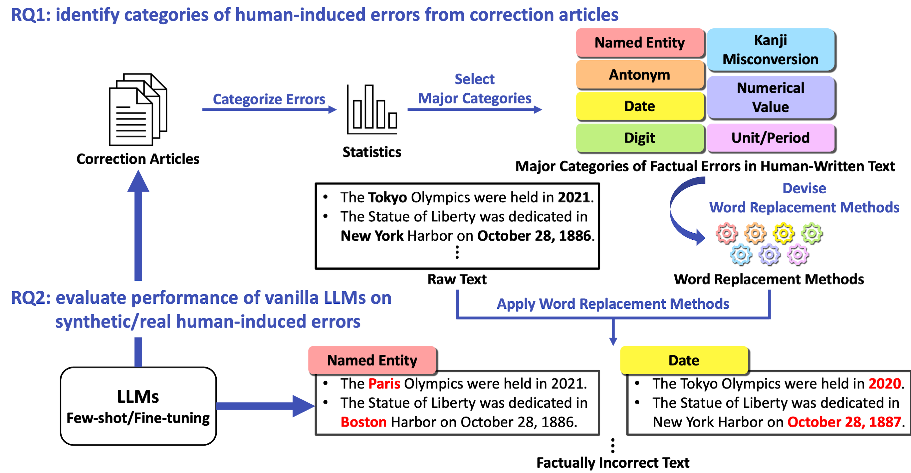

# An Empirical Analysis of Factual Errors in Human-Written Text and Its Application to Factual Error Detection

This repository provides implementations of synthetic data generation and experiments using Wikinews described in the paper ["An Empirical Analysis of Factual Errors in Human-Written Text and Its Application to Factual Error Detection"](https://arxiv.org/abs/2606.27959).

<div align="center">
  
</div>

## Features

- Simulate factual errors that are likely to occur in human-written text based on the analysis of corrections of newspaper articles.
- Design a task of detecting factually incorrect spans in a given text, considering on-the-ground editorial work.

## Requirements

- [uv](https://docs.astral.sh/uv/)
  ```shell
  curl -LsSf https://astral.sh/uv/install.sh | sh
  ```
  - Dependencies: see pyproject.toml and requirements/*.txt

- [Wikinews](https://www.wikinews.org/)
  ```shell
  wget https://dumps.wikimedia.org/jawikinews/20260601/jawikinews-20260601-pages-articles-multistream.xml.bz2
  bzip2 -d jawikinews-20260601-pages-articles-multistream.xml.bz2
  mv jawikinews-20260601-pages-articles-multistream.xml data/wikinews/
  ```

- [Wikipedia Entity Vectors](https://github.com/singletongue/WikiEntVec)
  ```shell
  wget https://www.cl.ecei.tohoku.ac.jp/~m-suzuki/jawiki_vector/data/20170201.tar.bz2
  tar xf 20170201.tar.bz2
  mv entity_vector/ model/
  rm -f 20170201.tar.bz2
  ```

## Environment Setup

```shell
# create python virtual environments
./scripts/create_venvs.sh

# create .env (we assume the use of Azure OpenAI)
echo 'API_KEY="$API_KEY"' >> .env
echo 'AZURE_ENDPOINT="$AZURE_ENDPOINT"' >> .env
echo 'API_VERSION="$API_VERSION"' >> .env
```

## Step-by-Step Guide

### 0. Prepare Wikinews

This step is to prepare formatted WikiNews corpus for generating synthetic data.

```shell
# get a title-to-timestamp mapping
venvs/preprocessing/bin/python scripts/preprocessing/get_title2timestamp.py \
  data/wikinews/jawikinews-20260601-pages-articles-multistream.xml \
  data/wikinews/title2timestamp.json

# extract text from Wikinews dump
venvs/preprocessing/bin/python -m wikiextractor.WikiExtractor \
  data/wikinews/jawikinews-20260601-pages-articles-multistream.xml \
  -o data/wikinews/wikiextractor/ \
  --json

# format raw WikiNews corpus
venvs/preprocessing/bin/python scripts/preprocessing/format_raw_wikinews_corpus.py \
  data/wikinews/wikiextractor/ \
  data/wikinews/title2timestamp.json \
  data/wikinews/20260601.jsonl
```

### 1. Generate Synthetic Data

This step is to generate synthetic data that simulate human-induced factual errors for each category.

```shell
# generate synthetic data for named_entity and kanji_misconversion
venvs/named_entity_and_kanji_misconversion/bin/python scripts/synthetic_data_generation/generate_synthetic_data.py \
  config/synthetic_data_generation.json \
  $WORK_DIR \
  --categories named_entity kanji_misconversion

# generate synthetic data for the remaining categories
venvs/remaining_categories/bin/python scripts/synthetic_data_generation/generate_synthetic_data.py \
  config/synthetic_data_generation.json \
  $WORK_DIR \
  --categories antonym numerical_value date digit unit
```

**NOTE**: The code has been tested on an NVIDIA V100 GPU (16GB);
therefore, a GPU with 16GB or more of memory is required if enabling GPU acceleration.

The execution takes almost a day, so we have also prepared the sample code for a quick start.

```shell
# generate synthetic data for named_entity and kanji_misconversion
venvs/named_entity_and_kanji_misconversion/bin/python scripts/synthetic_data_generation/samples/generate_synthetic_data.py \
  config/synthetic_data_generation.json \
  --category $CATEGORY  # any of {named_entity, kanji_misconversion}

# generate synthetic data for the remaining categories
venvs/remaining_categories/bin/python scripts/synthetic_data_generation/samples/generate_synthetic_data.py \
  config/synthetic_data_generation.json \
  --category $CATEGORY  # any of {antonym, numerical_value, date, digit, unit}
```

**NOTE**: While *named_entity* and *kanji_misconversion* require transformers<4.31.0 to run the ja_ginza_bert_large model, *antonym* requires transformers>=4.40.0 to run a Llama 3-based LLM (Swallow).
Since this dependency conflict cannot be resolved within a single venv, we decided to prepare two separate requirements.txt files.
Please use venvs/named_entity_and_kanji_misconversion to generate synthetic data for *named_entity* and *kanji_misconversion*, and venvs/remaining_categories for the remaining categories.

### 2. Filter Synthetic Data

This step is to filter out some noisy synthetic data (e.g., replace "欧州 (Europe)" with "ヨーロッパ (Europe)") using an LLM.

```shell
# filter out some noisy synthetic data for named_entity
venvs/remaining_categories/bin/python scripts/synthetic_data_generation/filter_synthetic_data.py \
  $WORK_DIR \
  config/synthetic_data_generation.json \
  --category named_entity

# filter out some noisy synthetic data for antonym
venvs/remaining_categories/bin/python scripts/synthetic_data_generation/filter_synthetic_data.py \
  $WORK_DIR \
  config/synthetic_data_generation.json \
  --category antonym
```

We have also prepared the sample code for a quick start.

```shell
venvs/remaining_categories/bin/python scripts/synthetic_data_generation/samples/filter_synthetic_data.py \
  config/synthetic_data_generation.json
```

### 3. Get Samples and Few-Shot Examples

This step is to get train and test samples and few-shot examples for evaluation.

```shell
venvs/remaining_categories/bin/python scripts/synthetic_data_generation/get_samples_and_few-shot_examples.py \
  $WORK_DIR \
  $OUT_DIR
```

#### Pipeline

The above procedure can be executed all at once using the following command.

```shell
./scripts/synthetic_data_generation/build_synthetic_data.sh \
  --work-dir=$WORK_DIR \
  --out-dir=$OUT_DIR
```

### 4. Fine-Tune LLM

This step is to fine-tune an LLM on sythetic data.

#### QLoRA

```shell
# fine-tune Qwen3-Swallow-8B-SFT-v0.2 on sythetic data with QLoRA
venvs/training/bin/python scripts/training_and_evaluation/run_qlora.py \
  -cn Qwen3-Swallow-8B-SFT-v0p2_qlora
# merge an adapter into Qwen3-Swallow-8B-SFT-v0.2
venvs/training/bin/python scripts/training_and_evaluation/merge_adapter_into_base_model.py \
  checkpoints/wikinews/Qwen3-Swallow-8B-SFT-v0p2/qlora/0/checkpoint-569/ \
  tokyotech-llm/Qwen3-Swallow-8B-SFT-v0.2 \
  finetuned/wikinews/Qwen3-Swallow-8B-SFT-v0p2/qlora/

# fine-tune gemma-4-E4B-it on sythetic data with QLoRA
venvs/training/bin/python scripts/training_and_evaluation/run_qlora.py \
  -cn gemma-4-E4B-it_qlora
# merge an adapter into gemma-4-E4B-it
venvs/training/bin/python scripts/training_and_evaluation/merge_adapter_into_base_model.py \
  checkpoints/wikinews/gemma-4-E4B-it/qlora/0/checkpoint-569/ \
  google/gemma-4-E4B-it \
  finetuned/wikinews/gemma-4-E4B-it/qlora/
```

**NOTE**: The code has been tested on an NVIDIA L4 (24GB) GPU.

#### Full-Parameter Fine-Tuning

```shell
# full-parameter fine-tune Qwen3-Swallow-8B-SFT-v0.2 on sythetic data
venvs/training/bin/deepspeed --num_gpus=2 scripts/training_and_evaluation/run_fullparameter_finetuning.py \
  --config-name=Qwen3-Swallow-8B-SFT-v0p2_fullpara
mv checkpoints/wikinews/Qwen3-Swallow-8B-SFT-v0p2/fullpara/0/checkpoint-569/ finetuned/wikinews/Qwen3-Swallow-8B-SFT-v0p2/fullpara/
# recover weights
venvs/training/bin/python finetuned/wikinews/Qwen3-Swallow-8B-SFT-v0p2/fullpara/zero_to_fp32.py \
  finetuned/wikinews/Qwen3-Swallow-8B-SFT-v0p2/fullpara/ \
  finetuned/wikinews/Qwen3-Swallow-8B-SFT-v0p2/fullpara/

# full-parameter fine-tune gemma-4-E4B-it on sythetic data
venvs/training/bin/deepspeed --num_gpus=2 scripts/training_and_evaluation/run_fullparameter_finetuning.py \
  --config-name=gemma-4-E4B-it_fullpara
mv checkpoints/wikinews/gemma-4-E4B-it/fullpara/0/checkpoint-569/ finetuned/wikinews/gemma-4-E4B-it/fullpara/
# recover weights
venvs/training/bin/python finetuned/wikinews/gemma-4-E4B-it/fullpara/zero_to_fp32.py \
  finetuned/wikinews/gemma-4-E4B-it/fullpara/ \
  finetuned/wikinews/gemma-4-E4B-it/fullpara/
```

**NOTE**: The code has been tested on two NVIDIA A100 (80GB) GPUs.

### 5. Evaluate LLM

This step is to evaluate an LLM on FED.

#### Run Inference of Closed-Weight LLMs in Few-Shot Setting

```shell
# run inference of gpt-5.4 in a few-shot setting
venvs/evaluation/bin/python scripts/training_and_evaluation/run_inference_of_closed_weight_llms.py \
  -cn GPT-5p4

# cf. run inference of gpt-5.4 in a zero-shot setting
venvs/evaluation/bin/python scripts/training_and_evaluation/run_inference_of_closed_weight_llms.py \
  -cn GPT-5p4 \
  num_shot=0
```

**NOTE**: You have to set values of

- `API_KEY`
- `AZURE_ENDPOINT`
- `API_VERSION`

in the `.env` file beforehand for the use of Azure OpenAI.

#### Run Inference of Open-Weight LLMs

```shell
# run inference of Qwen3-Swallow-8B-SFT-v0.2 in a few-shot setting
venvs/evaluation/bin/python scripts/training_and_evaluation/run_inference_of_open_weight_llms.py \
  -cn Qwen3-Swallow-8B-SFT-v0p2_fewshot

# run inference of gemma-4b-E4B-it in a few-shot setting
venvs/evaluation/bin/python scripts/training_and_evaluation/run_inference_of_open_weight_llms.py \
  -cn gemma-4b-E4B_fewshot

# run inference of Qwen3-Swallow-8B-SFT-v0.2 fine-tuned with QLoRA
venvs/evaluation/bin/python scripts/training_and_evaluation/run_inference_of_open_weight_llms.py \
  -cn Qwen3-Swallow-8B-SFT-v0p2_qlora

# run inference of gemma-4b-E4B-it fine-tuned with QLoRA
venvs/evaluation/bin/python scripts/training_and_evaluation/run_inference_of_open_weight_llms.py \
  -cn gemma-4-E4B-it_qlora

# run inference of full-parameter fine-tuned Qwen3-Swallow-8B-SFT-v0.2
venvs/evaluation/bin/python scripts/training_and_evaluation/run_inference_of_open_weight_llms.py \
  -cn Qwen3-Swallow-8B-SFT-v0p2_fullpara

# run inference of full-parameter fine-tuned gemma-4b-E4B-it
venvs/evaluation/bin/python scripts/training_and_evaluation/run_inference_of_open_weight_llms.py \
  -cn gemma-4-E4B-it_fullpara
```

**NOTE**: The code has been tested on an NVIDIA L4 (24GB) GPU.

#### Compute Metrics

```shell
venvs/evaluation/bin/python scripts/training_and_evaluation/compute_metrics.py \
  outputs \
  results
```

##  Experimental Results

- Word-level metrics on synthetic data generated from Wikinews

| Model ID | Setting | Precision | Recall | F1 |
|:------:|:------:|:------:|:-----:|:------:|
| GPT-5.4 | Few-Shot | 51.2 | 40.2 | 45.0 |
| Qwen3-Swallow-8B-SFT-v0.2 | Few-Shot | 63.7 | 6.0 | 11.0 |
| " | QLoRA | 30.0 | 28.4 | 29.2 |
| " | Full-Parameter Fine-Tuning | 23.8 | 21.6 | 22.7 |
| gemma-4-E4B-it | Few-shot | 37.9 | 8.9 | 14.4 |
| " | QLoRA | 27.4 | 21.9 | 24.3 |
| " | Full-Parameter Fine-Tuning | 100.0 | 5.5 | 10.5 |

## License

- The code in this project is licensed under the [MIT License](./LICENSE).
- The Wikinews textual content used for this project, as well as the synthetic data derived from it (`data/wikinews/`), is licensed under the [Creative Commons Attribution 2.5 International (CC BY 2.5)](https://creativecommons.org/licenses/by/2.5/) license - see https://dumps.wikimedia.org/legal.html.
  Every record keeps the identifier of its source article (`id` or `source_id`), which points to the corresponding article on https://ja.wikinews.org/.
- `src/fed4human/utils.py` contains code adapted from [HuggingFace Transformers](https://github.com/huggingface/transformers), licensed under the Apache License 2.0.
- Some dependencies are distributed under copyleft licenses (e.g., pykakasi under GPL-3.0-or-later, gensim under LGPL-2.1).
  They are installed separately with pip and are not redistributed as part of this repository, but their terms apply if you redistribute a bundled artifact (e.g., a container image) that includes them.

## Citation

```bibtex
@misc{iwamoto-etal-2026-empirical,
  title         = {An Empirical Analysis of Factual Errors in Human-Written Text and Its Application to Factual Error Detection},
  author        = {Kazuma Iwamoto and Kazumasa Omura and Shotaro Ishihara},
  year          = {2026},
  eprint        = {2606.27959},
  archivePrefix = {arXiv},
  primaryClass  = {cs.CL},
  url           = {https://arxiv.org/abs/2606.27959},
}
```
